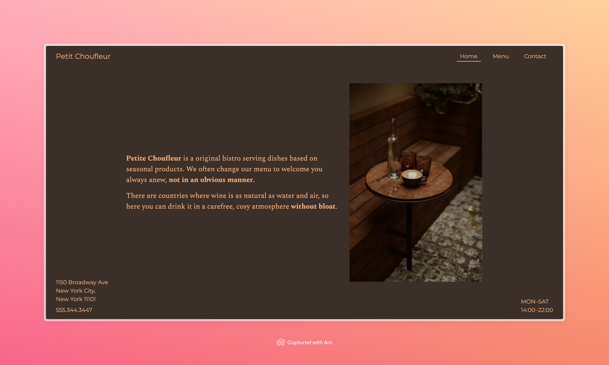

# Petit Choufleur

> A simple, dynamically rendered restaurant site for the fictional brand Petit Choufleur. This is a project submission for The Odin Project.

## Built With

- HTML
- CSS
- JavaScript
- Webpack

## Live Demo

[GitHub Pages: antonyotero.github.io/petit-choudfleur](https://antonyotero.github.io/petit-choufleur/)

## Authors

👤 **Antony Otero**

- GitHub: [@AntonyOtero](https://github.com/AntonyOtero)
- LinkedIn: [in/antonyotero](https://www.linkedin.com/in/antonyotero/)
- X: [@AntonyOtero](https://twitter.com/AntonyOtero)

## Show your support

Give a ⭐️ if you like this project!

## Acknowledgments

- [@TheOdinProject](https://github.com/TheOdinProject)

## Useful Resources
- [Google Fonts](https://fonts.google.com/)
- [Typeface](https://typescale.com/)
- [Khroma](https://www.khroma.co/generator)
- [Colorable](https://colorable.jxnblk.com/)

## 📝 License

This project is [MIT](LICENSE) licensed.
